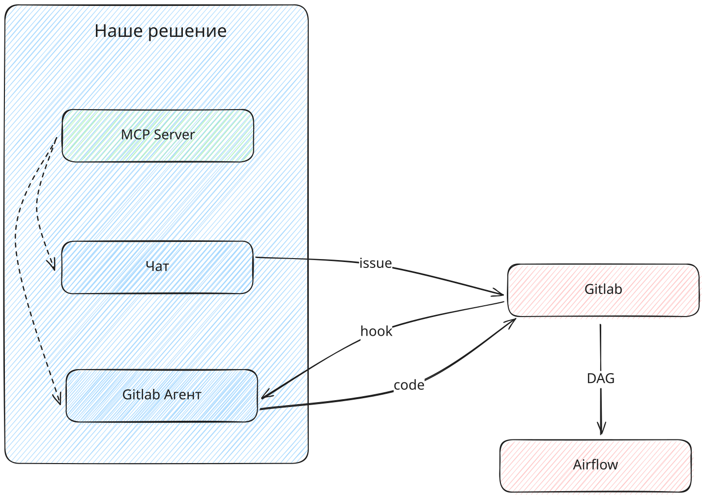

# DE chat backend

Проект бэк части LLM чата для взаимодействия с ДЕ ассистентом.

Агент для чата реализован как часть бэкенд сервиса. Можно сказать, что мы пытались следовать API-first подходу.

Наш агент построен по ReAct-ивному (реактивному) подходу, подключется к MCP серверу и обеспечивает взаимодействие пользователя с агентом.

Агент снабжен кратковременной памятью для более естественного общения.

## Развертывание сервиса

Наш проект подготовлен для контейнеризации и содержит Dockerfile для сборки образа.

Для работы сервиса необходимо настроить следующие параметры переменных окружения:
- HTTP_PROXY - адрес прокси сервера, если ваша среда не имеет прямого выхода в интернет
- HTTPS_PROXY - адрес прокси сервера для https запросов, если ваша среда не имеет прямого выхода в интернет

- API_KEY - Ключ для подключения к LLM 
- BASE_URL - URL для подключения к LLM
- MODEL_NAME - Имя модели
- FOLDER - Имя проекта в Яндексе, оно нужно для формирования имени модели. Оставьте пустым, если не требуется
- MCP_CONFIG - Путь до конфигурационного файла, содержащего настройки подключения к MCP серверу
- GITLAB_URL - адрес сервера Gitlab для доступа к апи
- GITLAB_TOKEN - действующий токен с уровнем доступа, чтение и запись через API
- PROJECT_PATH - путь до проекта, в котором будут создаваться ветки
- POSTGRESQL_URL - URL Postgresql базы

Для сборки образа указываем все необходимые переменные окружения и запускаем процесс сборки
```
$ git clone https://github.com/AnatoliyAksenov/chat-app-mcp.git
$ cd chat-app-mcp
$ docker build -t chat-app-mcp:0.0.1 --build-arg HTTPS_PROXY=http://10.0.0.7:3128 .
```

Также, для своего тестового контура мы настроили сборку и деплой приложения через cicd.


## Архитектура решения

__Продублировано из репозитория Gitlab Агента__

Агент состоит из двух основных модулей:
- LLM Чат (пользовательский интерфейс)
- LLM Gitlab Агент (сервис)

Также, для работы сервисов необходим MCP сервер с набором инструметов для взаимодействия с базами данных и хранилищами.



Создание нового пайплайна для загрузки данных начинается в чате.
Пользователь в процессе общения с агентом передает все необходимые данные для создания новой загрузки данных.
Агент чата, после сбора необходимых данных, создает в приложении Gitlab issue, где собрана вся информация для создания пайплайна.
После создания issue Gitlab вызывает webhook к LLM Gitlab Агенту и запускает обработку issue. Gitlab Агент обрабатывает issue и создает в репозитории Gitlab в выделенном проекте новую ветку и передает в нее весь созданный код и документацию, создает Merge Request и завершает свою работу.

При принятии Merge Request'a срабатывает cicd по доставке изменений в Airflow.

Связанные проекты:

- MCP Сервер: https://github.com/AnatoliyAksenov/chat-app-mcp
- LLM Chat backend: https://github.com/AnatoliyAksenov/chat-app-backend
- LLM Chat frontend: https://github.com/AnatoliyAksenov/chat-app-frontend
- Gitlab Agent: https://github.com/AnatoliyAksenov/gitlab-agent


Также, мы подготовили развернутый стенд

# Развертывание и зависимости

Мы используем persisten storage для хранения сообщений чата. Для корректной работы необходимо установить для Postgresql расширение pgvector

```
docker run --detach --name postgres \
--restart always \
-e POSTGRES_USER=test \
-e POSTGRES_PASSWORD=test \
-e POSTGRES_DB=chat \
-p 5431:5432  pgvector/pgvector:pg17
```